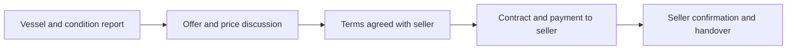

[Suomi](README.md) · **English** · [Svenska](README.sv.md)

# Kopilotti BoatSales

**Digital boat sales. Part of Kopilotti Sales.**

BoatSales brings digital price negotiation into the sales journey of boat dealers and yacht brokers. Buyers review a vessel and its condition report, make an offer and progress towards a sale with the seller.

**Status: pilot preparation. This public repository contains a product presentation and static website, not an operational boat sales service.**


## The same Sales foundation, a dedicated marine application

BoatSales uses the same negotiation engine as Kopilotti Sales. Vessel details, condition reports and the marine buying journey form a dedicated application. The seller defines commercial terms and handles cases requiring personal judgement.

This repository contains a product presentation and static website. The engine is not included or connected to the website. Production claims in the Sales repository do not establish BoatSales production readiness.

[Sales public product overview](https://github.com/mikko-lab/kopilotti-sales-demo) · [Kopilotti Sales website](https://kopilotti.online/en/)

## Why BoatSales?

- Buyer interest can arise outside opening hours.
- A condition report supports an informed price discussion.
- The seller retains the relationship, commercial terms and responsibility for the sale.
- Special conditions and exceptions are handled by the seller.

The goal is a smoother path from interest to an offer. No increase in sales or particular conversion rate is promised.

## Planned buying journey



**Every vessel must have a completed condition inspection and an existing report before sales open.** This presentation sets no minimum vessel price.

## Audience and commercial model

The initial release is for professional boat dealers and yacht brokers. Private listings and trade-ins are outside its scope.

The proposed success fee is **1–2% of the final sale price**. The exact rate and taxes are agreed before the pilot. The fee is triggered only when the seller confirms receipt of the full purchase payment. An offer or financing approval alone is not enough.

Funds go directly to the seller. BoatSales does not receive, hold or transfer purchase funds or grant financing. Contracts, financing and delivery are handled by the seller and their chosen providers.

## What this repository provides

- Finnish, English and Swedish presentation and privacy pages.
- Sales-aligned branding with a dedicated marine identity.
- Process, survey requirements, proposed pricing, FAQ and email contact.
- A local preview without accounts, an engine connection or transactions.

There is no separate BoatSales demo here. Customer data, internal pricing boundaries, engine implementation, credentials and private development history are excluded.

## Next steps

1. Prospective pilot partners explore the product presentation and discuss their needs as sellers.
2. Pilot markets, responsibilities and commercial terms are agreed.
3. The operational marine sales service and required connections are verified before use.

A global production service, bank connections or ready-to-use financing integrations are not promised. The website accepts no purchase offers or payments.

## Preview and materials

Node.js 22 or later, no dependencies to install:

```sh
node preview.cjs
```

Open `http://127.0.0.1:4318/`. Finnish: `/fi/`; Swedish: `/sv/`. If the port is in use: `PORT=4319 node preview.cjs`.

[Repository structure and review](docs/review.md) · [License](LICENSE)

## Contact

[hello@kopilotti.online](mailto:hello@kopilotti.online?subject=BoatSales)

BoatSales is proprietary. See [LICENSE](LICENSE). Inter retains its [own license](site/inter-LICENSE.txt).
