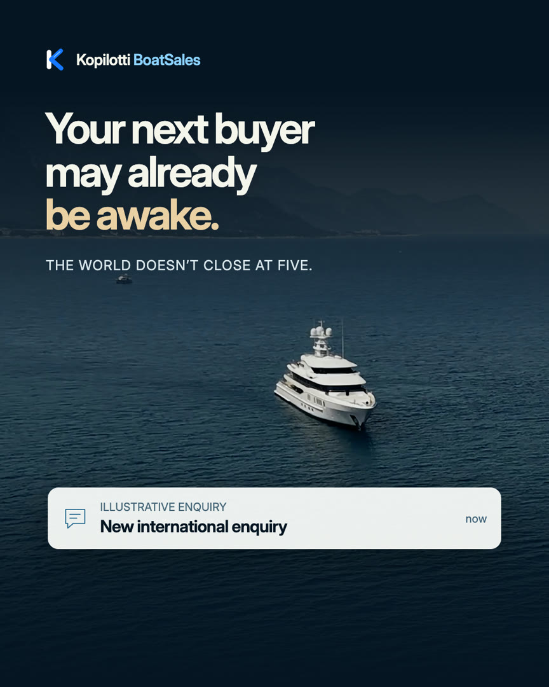
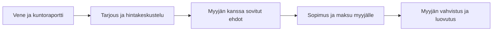

**Suomi** · [English](README.en.md) · [Svenska](README.sv.md)

# Kopilotti BoatSales

**Digitaalinen venemyyjä. Osa Kopilotti Salesia.**

BoatSales tuo digitaalisen hintaneuvottelun veneliikkeiden ja jahtivälittäjien myyntipolkuun. Ostaja tutustuu veneeseen ja sen kuntoraporttiin, tekee tarjouksen ja etenee myyjän kanssa kohti kauppaa.

**Tila: pilotin valmistelu. Tämä julkinen repo sisältää tuote-esittelyn ja staattisen verkkosivuston, ei toimivaa veneiden myyntipalvelua.**


## Katso BoatSalesin esittelyvideo

<a href="https://boats.kopilotti.online/fi/#video"></a>

[▶ Katso esittelyvideo (1:13)](https://boats.kopilotti.online/fi/#video) · [Lataa video (MP4, 16 Mt)](site/media/boatsales-introduction-2026-09.mp4)

Englanninkielinen synteettinen kerronta · englanninkielinen tekstitys mukana · 1 min 13 s. BoatSales on pilotin valmisteluvaiheessa. Video havainnollistaa suunniteltua käyttökokemusta.

## Sama Sales, oma vene-sovellus

BoatSales käyttää samaa neuvottelumoottoria kuin Kopilotti Sales. Veneiden tiedot, kuntoraportit ja venekaupan asiakaspolku muodostavat oman sovelluksensa. Myyjä määrittää kaupalliset ehdot ja käsittelee henkilökohtaista harkintaa vaativat tilanteet.

Tämä repositorio sisältää tuote-esittelyn ja staattisen verkkosivuston. Moottori ei sisälly tähän repoon eikä verkkosivusto kytkeydy siihen. Salesin julkisen repon tuotantotila ei ole osoitus BoatSalesin tuotantovalmiudesta.

[Salesin julkinen tuote-esittely](https://github.com/mikko-lab/kopilotti-sales-demo) · [Kopilotti Sales -verkkosivusto](https://kopilotti.online/)

## Miksi BoatSales?

- Ostajan kiinnostus voi syntyä myyjän aukioloaikojen ulkopuolella.
- Kuntoraportti antaa tietoa hintakeskustelun tueksi.
- Myyjä säilyttää asiakassuhteen, kaupalliset ehdot ja vastuun kaupasta.
- Erityisehdot ja poikkeustilanteet käsitellään myyjän kanssa.

Tavoitteena on sujuvoittaa siirtymää kiinnostuksesta tarjoukseen. Kauppamäärien kasvua tai tiettyä konversiota ei luvata.

## Suunniteltu ostopolku



**Jokaisen veneen pitää olla kuntotarkastettu ja raportin olemassa ennen myynnin avaamista.** Veneille ei aseteta tällä esittelysivustolla vähimmäishintaa.

## Kenelle ja millä ehdoilla?

Ensimmäinen vaihe on veneliikkeille ja jahtivälittäjille. Yksityismyynti ja vaihtoveneet eivät kuulu ensimmäiseen versioon.

Ehdotettu myyntipalkkio on **1–2 % lopullisesta kauppahinnasta**, ja tarkka palkkio sekä verot sovitaan ennen pilottia. Palkkio syntyy vasta myyjän vahvistettua koko kauppahinnan vastaanoton. Pelkkä tarjous tai rahoituspäätös ei riitä.

Rahat maksetaan suoraan myyjälle. BoatSales ei vastaanota, säilytä tai välitä kauppavaroja eikä myönnä rahoitusta. Myyjä ja tämän valitsemat palveluntarjoajat hoitavat sopimukset, rahoituksen ja luovutuksen.

## Mitä on valmiina tässä repossa?

- Suomen-, englannin- ja ruotsinkielinen esittely sekä tietosuojasivut.
- Salesin brändiin sovitettu BoatSales-ilme ja oma veneilykuvasto.
- Toimintatapa, kuntoraporttivaatimus, palkkiomalli, UKK ja yhteydenotto sähköpostitse.
- Paikallinen esikatselu ilman kirjautumista, moottoriyhteyttä tai kaupankäyntiä.

Erillistä BoatSales-demoa ei julkaista tässä repossa. Asiakasdataa, sisäisiä hintarajoja, moottoritoteutusta, tunnuksia tai yksityisen kehityksen historiaa ei sisällytetä.

## Seuraavat vaiheet

1. Pilottikumppanit tutustuvat tuote-esittelyyn ja keskustelevat tarpeistaan myyjän näkökulmasta.
2. Pilotin markkinat, vastuut ja kaupalliset ehdot sovitaan.
3. Varsinainen veneiden myyntipalvelu ja tarvittavat yhteydet varmennetaan ennen käyttöönottoa.

Kansainvälistä tuotantopalvelua, pankkiyhteyksiä tai valmiita rahoitusintegraatioita ei luvata. Sivusto ei ota vastaan ostotarjouksia tai maksuja.

## Esikatselu ja materiaalit

Node.js 22 tai uudempi, ei asennettavia riippuvuuksia:

```sh
node preview.cjs
```

Avaa `http://127.0.0.1:4318/fi/`. Englanti on juuressa ja ruotsi polussa `/sv/`. Jos portti on käytössä, käynnistä `PORT=4319 node preview.cjs`.

[Repon rakenne ja tarkistus](docs/review.md) · [Lisenssi](LICENSE)

## Yhteydenotto

[hello@kopilotti.online](mailto:hello@kopilotti.online?subject=BoatSales)

BoatSales on omisteinen tuote. Katso [LICENSE](LICENSE). Inter-fontin oma lisenssi on [tässä](site/inter-LICENSE.txt).
