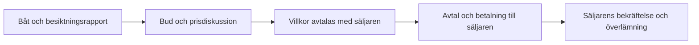

[Suomi](README.md) · [English](README.en.md) · **Svenska**

# Kopilotti BoatSales

**Digital båtförsäljning. En del av Kopilotti Sales.**

BoatSales för in digital prisförhandling i båthandlares och yachtmäklares försäljningsprocess. Köparen läser om båten och tar del av besiktningsrapporten, lämnar ett bud och går vidare mot en affär med säljaren.

**Status: förberedelse för pilot. Detta repo är en privat granskningsversion. Offentliggörande kräver ägarens separata godkännande.**


## Samma Sales-grund, en egen båttjänst

BoatSales använder samma förhandlingsmotor som Kopilotti Sales. Båtuppgifter, besiktningsrapporter och köpresan för båtar bildar en egen applikation. Säljaren bestämmer affärsvillkoren och hanterar situationer som kräver personlig bedömning.

Detta repo innehåller en produktpresentation och en statisk webbplats. Motorn ingår inte och är inte ansluten till webbplatsen. Uppgifter om Sales produktionsstatus visar inte att BoatSales är produktionsklart.

[Sales offentliga produktpresentation](https://github.com/mikko-lab/kopilotti-sales-demo) · [Kopilotti Sales webbplats](https://kopilotti.online/en/)

## Varför BoatSales?

- Köparens intresse kan uppstå utanför öppettiderna.
- Besiktningsrapporten ger underlag för en informerad prisdiskussion.
- Säljaren behåller kundrelationen, affärsvillkoren och ansvaret för försäljningen.
- Särskilda villkor och undantag hanteras av säljaren.

Målet är en smidigare väg från intresse till bud. Ökad försäljning eller en viss konverteringsgrad utlovas inte.

## Planerad köpresa



**Varje båt ska vara besiktigad och ha en befintlig rapport innan försäljningen öppnas.** Presentationen anger inget minimipris för båtar.

## Målgrupp och affärsmodell

Den första versionen riktar sig till professionella båthandlare och yachtmäklare. Privatannonser och inbytesbåtar ingår inte.

Det föreslagna arvodet är **1–2 % av det slutliga försäljningspriset**. Exakt arvode och skatter avtalas före piloten. Arvodet utlöses först när säljaren bekräftar att hela köpeskillingen har tagits emot. Ett bud eller finansieringsbeslut räcker inte.

Betalningen går direkt till säljaren. BoatSales tar inte emot, förvarar eller överför köpeskillingen och beviljar inte finansiering. Säljaren och valda leverantörer hanterar avtal, finansiering och leverans.

## Vad finns i detta repo?

- Presentation och integritetssidor på finska, engelska och svenska.
- Sales visuella identitet med en egen inriktning på båtar.
- Arbetssätt, besiktningskrav, föreslagen prissättning, frågor och svar samt e-postkontakt.
- Lokal förhandsvisning utan konton, motoranslutning eller transaktioner.

Ingen separat BoatSales-demo ingår. Kunddata, interna prisgränser, motorns implementation, inloggningsuppgifter och privat utvecklingshistorik är uteslutna.

## Nästa steg

1. Ägaren granskar innehållet och godkänner ett eventuellt offentliggörande separat.
2. Pilotens marknader, ansvar och affärsvillkor avtalas.
3. Den operativa båttjänsten och nödvändiga anslutningar verifieras före användning.

En global produktionstjänst, bankanslutningar eller färdiga finansieringsintegrationer utlovas inte. Webbplatsen tar inte emot köpbud eller betalningar.

## Förhandsvisning och material

Node.js 22 eller senare, inga beroenden att installera:

```sh
node preview.cjs
```

Öppna `http://127.0.0.1:4318/sv/`. Engelska finns i roten och finska under `/fi/`. Om porten används: `PORT=4319 node preview.cjs`.

[Repots struktur och granskning](docs/review.md) · [Licens](LICENSE)

## Kontakt

[hello@kopilotti.online](mailto:hello@kopilotti.online?subject=BoatSales)

BoatSales är en proprietär produkt. Se [LICENSE](LICENSE). Inter behåller sin [egen licens](site/inter-LICENSE.txt).
